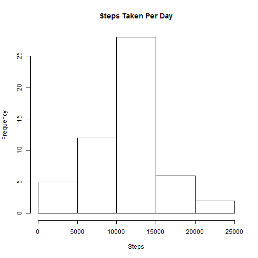
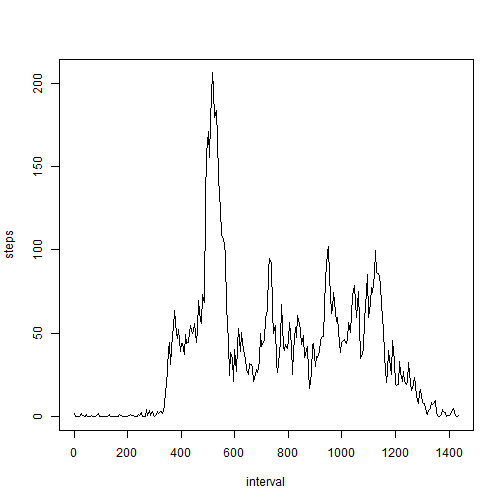
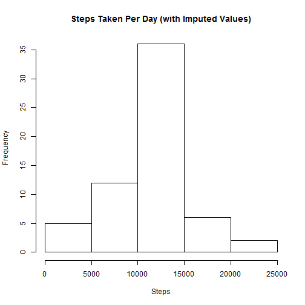
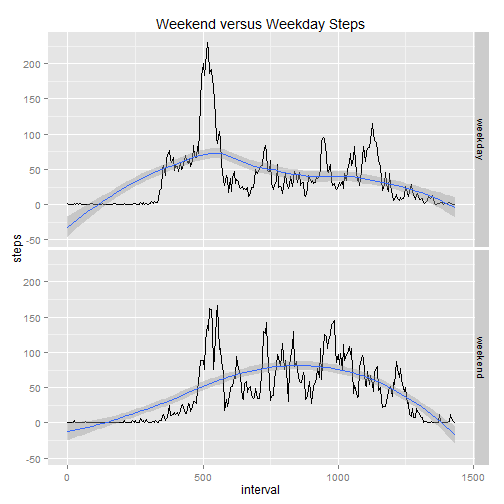

# Reproducible Research: Peer Assessment 1

## Loading and preprocessing the data


```r
x <- "activity.zip"
y <- "activity.csv"
if (!file.exists(y)) {
    con = unzip(x)
}
b <- read.csv(y)
summary(b)
```

```
##      steps               date          interval   
##  Min.   :  0.0   2012-10-01:  288   Min.   :   0  
##  1st Qu.:  0.0   2012-10-02:  288   1st Qu.: 589  
##  Median :  0.0   2012-10-03:  288   Median :1178  
##  Mean   : 37.4   2012-10-04:  288   Mean   :1178  
##  3rd Qu.: 12.0   2012-10-05:  288   3rd Qu.:1766  
##  Max.   :806.0   2012-10-06:  288   Max.   :2355  
##  NA's   :2304    (Other)   :15840
```


The data had the date formatted as a factor, so it was changed to a data format.  Also, the time was formatted as hhmm, so it was converted to the minute of the day.


```r
b$date = as.Date(b$date)

m <- b$interval%%100
n <- b$interval%/%100
o <- m + 60 * n
b$interval <- o
summary(b)
```

```
##      steps            date               interval   
##  Min.   :  0.0   Min.   :2012-10-01   Min.   :   0  
##  1st Qu.:  0.0   1st Qu.:2012-10-16   1st Qu.: 359  
##  Median :  0.0   Median :2012-10-31   Median : 718  
##  Mean   : 37.4   Mean   :2012-10-31   Mean   : 718  
##  3rd Qu.: 12.0   3rd Qu.:2012-11-15   3rd Qu.:1076  
##  Max.   :806.0   Max.   :2012-11-30   Max.   :1435  
##  NA's   :2304
```


## What is mean total number of steps taken per day?

```r
e <- xtabs(steps ~ date, data = b)
hist(e, main = "Steps Taken Per Day", xlab = "Steps")
```

 

```r
median(e)
```

```
## 2012-11-12 
##      10765
```

```r
mean(e)
```

```
## [1] 10766
```


## What is the average daily activity pattern?

A daily average of steps was taken over the daily interval.

```r
h <- aggregate(steps ~ interval, b, mean)
plot(h, type = "l")
```

 


The maximum can be seen at 515 minutes, or 8:35 am.

```r
i <- max(h[[2]])
j <- which(h[[2]] == i)
k <- h[[1]][[j]]
k
```

```
## [1] 515
```

```r
k%/%60
```

```
## [1] 8
```

```r
k%%60
```

```
## [1] 35
```


## Imputing missing values

The number of table entries with missing values was found.

```r
sum(!complete.cases(b))
```

```
## [1] 2304
```


Missing values of steps were filled in with the daily average steps (over the daily interval).  This leaves the previous graph unchanged.

```r
l <- complete.cases(b)
r <- length(xtabs(~b$date))
p <- rep(h$steps, r)
q <- b$steps
q[!l] <- p[!l]
b$steps <- q
```


The total daily number of steps changes because we are adding steps.

The average daily number of steps don't change because imputed values that match the average don't change the average.


```r
e2 <- xtabs(steps ~ date, data = b)
hist(e2, main = "Steps Taken Per Day (with Imputed Values)", xlab = "Steps")
```

 

```r
median(e2)
```

```
## 2012-11-04 
##      10766
```

```r
mean(e2)
```

```
## [1] 10766
```


Remember the old values


```r
hist(e, main = "Steps Taken Per Day", xlab = "Steps")
```

 

```r
median(e)
```

```
## 2012-11-12 
##      10765
```

```r
mean(e)
```

```
## [1] 10766
```


## Are there differences in activity patterns between weekdays and weekends?

A new factor variable was added to tell whether the day was a weekend or a weekday.

```r
s <- weekdays(b$date)
t <- (s == "Sunday") + (s == "Saturday")
u <- as.factor(t)
levels(u) <- c("weekday", "weekend")
b$weekend <- u
```


Daily averages were calculated over this factor, too.  The effect of filling in the data can be seen because the "weekday early riser" behavior is averaged into the "weekend sleep in"" behavior


```r
require(ggplot2)
```

```
## Loading required package: ggplot2
```

```r
w <- aggregate(steps ~ interval + weekend, b, mean)
v <- qplot(interval, steps, data = w, facets = weekend ~ ., geom = c("line", 
    "smooth"))
v + labs(title = "Weekend versus Weekday Steps")
```

```
## geom_smooth: method="auto" and size of largest group is <1000, so using loess. Use 'method = x' to change the smoothing method.
## geom_smooth: method="auto" and size of largest group is <1000, so using loess. Use 'method = x' to change the smoothing method.
```

 


